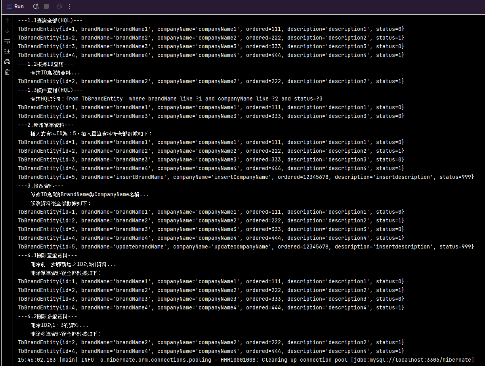

# 說明

* 本項目為使用Hibernate進行資料庫基本CRUD的練習，包含HQL的使用
* 練習內容如下

  * 1.查詢
    * 1.1查詢全部(HQL)
    * 1.2根據ID查詢
    * 1.3條件查詢(HQL)
  * 2.新增單筆資料
  * 3.修改資料
  * 4.刪除資料
    * 4.1刪除單筆資料
    * 4.2刪除多筆資料
* 運行結果如下圖：

  
